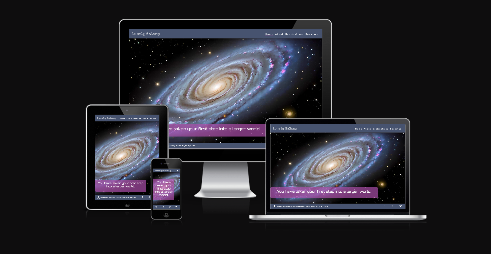
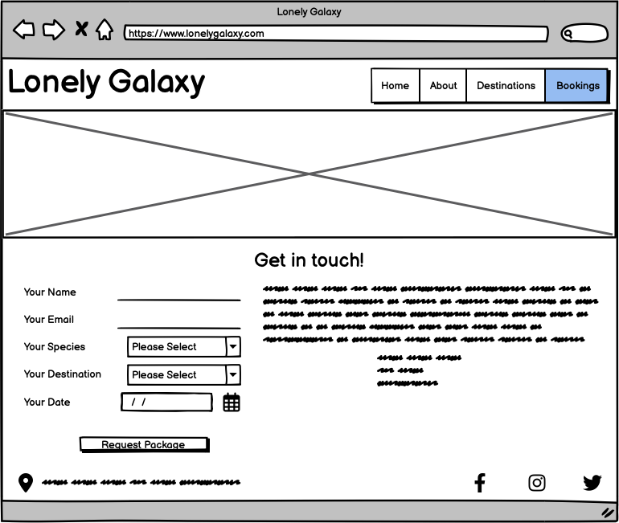
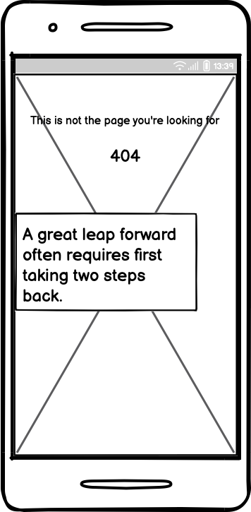
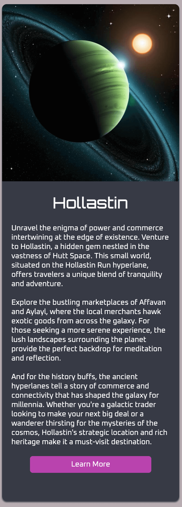
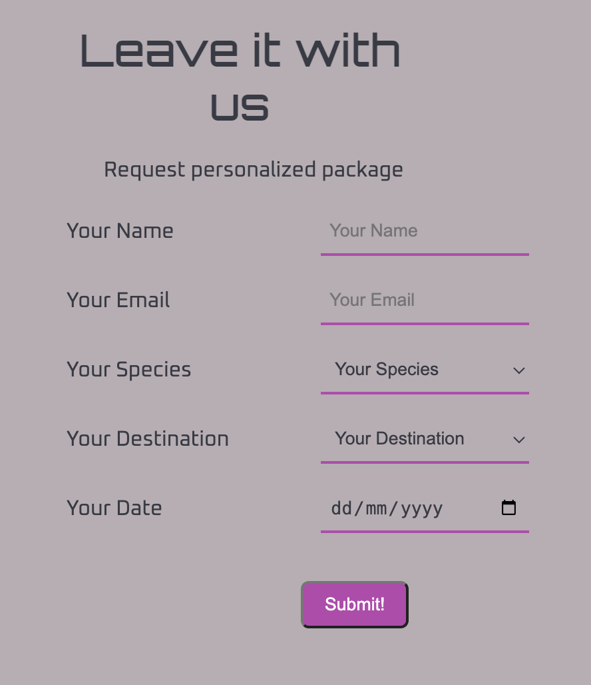
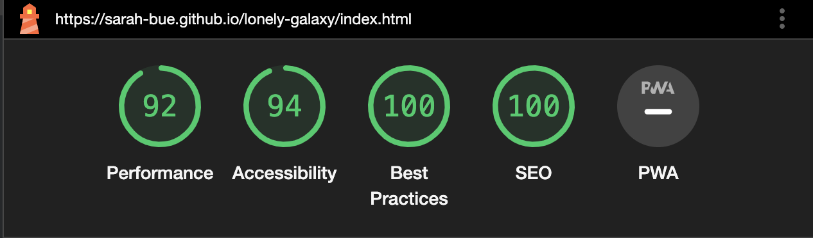
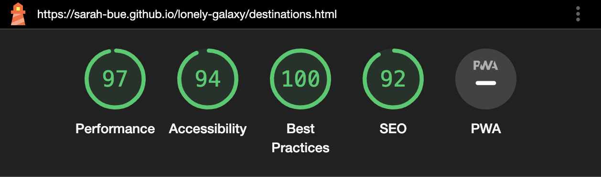
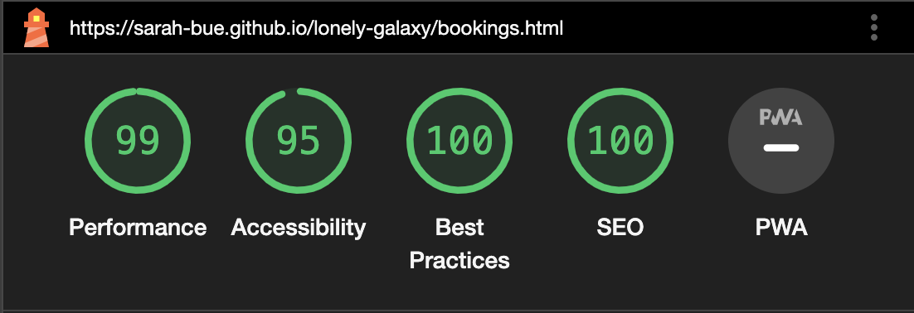
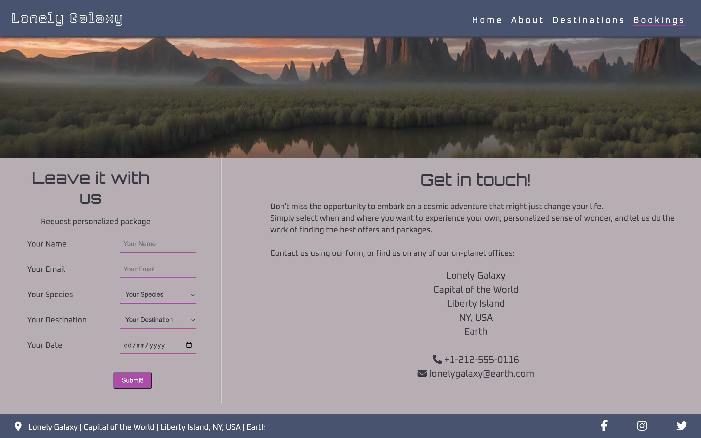
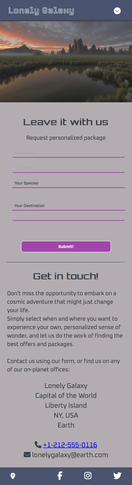

# Lonely Galaxy

Lonely Galaxy is a fictional travel guide with branches all across the galaxy, including Earth. Lonely Galaxy partners with a wide variety of planet-based organisations to ensure a unique travel experience for its clients. 

The purpose of the website is to provide both new and existing clients with information about the business and its services. Clients can view the catalogue of partner planets and request their own personalised package. 

Visit the deployed website [here](https://sarah-bue.github.io/lonely-galaxy/).

## Table of contents
1. [User Experience (UX)](#user-experience-ux)
    1. [Project Goals](#project-goals)
    2. [User Stories](#user-stories)
    3. [Color Scheme](#color-scheme)
    4. [Typography](#typography)
    5. [Wireframes](#wireframes)
2. [Features](#features)
    1. [General](#general)
    2. [Home Page](#home-page)
    3. [About Page](#about-page)
    4. [Destinations Page](#destinations-page)
    5. [Bookings Page](#bookings-page)
    6. [404 Page](#404-page)
 3. [Technologies Used](#technologies-used)
    1. [Languages](#languagesd)
    2. [Frameworks, Libraries, and Programs](#frameworks-libraries-and-programs)
4. [Testing](#testing)
    1. [Testing User Stories](#testing-user-stories)
    2. [Code Validation](#code-validation)
    3. [Accessibility](#accessibility)
    4. [Tools Testing](#tools-testing)
    5. [Manual Testing](#manual-testing)
5. [Finished Product](#finished-product)
6. [Deployment](#deployment)
    1. [GitHub Pages](#github-pages)
7. [Credits](#credits)
    1. [Content](#content)
    2. [Media](#media)
    3. [Code](#code)
8. [Acknowledgements](#acknowledgements)

## User Experience (UX)
### Project Goals
- The website should present glimpses into other worlds, appealing to potential clients’ sense of wonder and adventure. 
- The website should convey that Lonely Galaxy staff are excited to help clients achieve their dream experience. 
- The website should provide clients with an easy way to find and contact Lonely Galaxy. 
- The website should offer information about their partner planets and possible destinations. 
- The website should allow clients to easily contact lonely Galaxy to request more information or a personalised package for their journey. 

### User Stories
- As a client, I want to easily find the business’ contact information and locations.
- As a client, I want to navigate the website intuitively on different devices. 
- As a client, I want to learn more about the business and its offers. 
- As a client, I want to be able to request more information directly from the website.
- As a client, I want to connect with the business on social media. 

### Color Scheme

The colours used for this site are two different types of grey (#b7adb2 and #383a45), a dark blue (#445371), and a bright pink (#b943ae). 
The lighter of the two grey tones is used as the main background color, while the blue color is used to visually separate the header and footer sections from the main body of the page.
The dark grey tone is used for drop shadow effects to give some elements are more plastic view, as well as for the main font. 
The pink color is used for highlighter effects as well as to visually distinguish the buttons.
Additionally, white is used as a text color on darker backgrounds to create a greater contrast and increase accessibility.

### Typography
The site makes use of three fonts which have been imported from Google Fonts. 
Oxanium is used as the main font. 
Orbitron is used for headings. 
Tourney is used for the logo. 
The fallback font for each font, in case any aren’t loaded correctly, is Sans Serif.

### Wireframes
[Balsamiq](https://balsamiq.com/) was used to create wireframes for each page to display their appearance on both mobile and larger devices. 

Page | Desktop Version | Mobile Version
--- | --- | ---
Home |  | 
About |  | 
Destinations |  | 
Bookings |  | 
404 |  | 

[Back to top ⇧](#lonely-galaxy)

## Features
### General
- The site was built using a mobile-first approach. 
- Media queries were used to adapt features for larger screens to ensure responsive designs across different sizes. 
- Layout and color scheme were kept similar across pages to ensure a coherent look and effectively structure and present the information to clients.

**Header**

- The header is identical across all pages.
- The header contains the business logo in the top left, and a navigation bar in the top right. 
- The logo functions as a link to the landing page.
- The navigation bar  contains links to all other pages in the top right. 
- The current page is highlighted in a different color, and a hover effect for the remaining links provides additional feedback to the user. 

**Footer**

- The footer is identical across all pages.
- The footer contains a location icon in the bottom left, and links to the business' social media channels in the bottom right.
- On larger screens, the business' address appears next to the location icon.
- The location icon functions as a link to the Bookings page, which includes the business' full planetary address and contact information.

### Home Page
**Main Image**

- The main image is designed to attract attention and showcase the vastness of the galaxy.
- Part of the image is overlayed by a quote that is meant to inspire and encourage clients to explore further.
- The quote serves as a link to the About page.

### About Page
**Banner**

- The banner image is an eye-catching, on-planet view of Rendili, one of Lonely Galaxy's partner planets.

**Text**

- The text section provides clients with more information about the business and its services.

### Destinations Page

- The Destinations page is the only page without a banner or main image. Instead, it contains cards for each possible destination.
- The cards are made up of an image of the planetary view at the top, followed by some information about this destination. At the bottom of the card, a link takes clients to the Bookings page.
- Each card is fully responsive and easy to edit or replicate in case destinations change or more destinations are added.

### Bookings Page
**Banner**

- The banner image is a serene, on-planet view of Hollastin, one of Lonely Galaxy's partner planets.

**Contact Form**

- The contact form allows clients to request more information as well as their own, personalized offer for a travel experience with Lonely Galaxy.

**Get in touch**

- This section displays Lonely Planet's physical address and contact information based on the planet the client is accessing the website from.

### 404 Page

- This page is displayed in case of broken or misspelled links, and contains a link back to the Home page.
- The image is an on-planet view of the Senate Building on Coruscant, one of Lonely Galaxy's partner planets.

[Back to top ⇧](#lonely-galaxy)

## Technologies Used
### Languages
- [HTML5](https://en.wikipedia.org/wiki/HTML5)
- [CSS3](https://en.wikipedia.org/wiki/CSS)

### Frameworks, Libraries, and Programs 
- [Google Fonts](https://fonts.google.com/)
    - Google Fonts was used to find suitable font pairings, as well as link to the fonts in the .html files.

- [Font Awesome](https://fontawesome.com/)
    - Font Awesome was used to add icons in order to create a better visual experience for UX purposes.

- [Favicon](favicon.io)
    - Favicon was used to create and import a favicon for the website.

- [Image Color Picker](https://imagecolorpicker.com/)
    - Image Color Picker was used to identify the HEX and RGB color codes used in the main image on the Home page, and to create a color palette based on the image.

- [AI Alt Text Generator](https://alttext.ai/)
    - AI Alt Text Generator was used to help create alt text for all images.

- [TinyPNG](https://tinypng.com/)
    - TinyPNG was used to reduce the file size of the images for the website.

- [GitPod](https://gitpod.io/)
    - GitPod was used for writing code, committing, and then pushing to GitHub.

- [GitHub](https://github.com/)
    - GitHub was used to store the project after pushing.

- [Balsamiq](https://balsamiq.com/)
    - Balsamiq was used to create the wireframes during the design phase of the project.

- [Am I Responsive?](http://ami.responsivedesign.is/#)
    - Am I Responsive was used to ensure responsive design throughout the process and to generate the mockup images at the top of this file.

- [Responsive Design Checker](https://www.responsivedesignchecker.com/)
    - Responsive Design Checker was used in the testing process to check responsiveness on various devices.

- [Chrome DevTools](https://developer.chrome.com/docs/devtools/)
    - Chrome DevTools was used during the development process for code review and to test responsiveness and accessibility.

- [W3C Markup Validator](https://validator.w3.org/)
    - W3C Markup Validator was used to validate the HTML code.

- [W3C CSS Validator](https://jigsaw.w3.org/css-validator/)
    - W3C CSS Validator was used to validate the CSS code.

[Back to top ⇧](#lonely-galaxy)

## Testing
### Testing User Stories
As a client, I want to easily find the business’ contact information and locations.
- The footer of each page contains the address as well as a link to the Bookings Page, wihch contains the address and contact information of Lonely Planet's planetary headquarters.

As a client, I want to navigate the website intuitively on different devices. 
- The navigation bar is visible on all pages on larger screens, and easily accessible via a dropdown menu on mobile devices.
- The pages maintain a similar structure so clients can focus on the content.
- The content is structured using headings and paragraphs to allow for easy navigation.

As a client, I want to learn more about the business and its offers.
- The About page contains useful information about the business and its services.
- The Destinations page contains further information about available offers, broken down by destination.
- The Bookings page contains a form to request more information.

As a client, I want to be able to request more information directly from the website.
- The form on the Bookings page can be used to request personalized offers depending on clients' needs.

As a client, I want to connect with the business on social media. 
- The footer on each page contains links to Lonely Galaxy's social media channels.

### Code Validation
[W3C Markup Validator](https://validator.w3.org/) and [W3C CSS Validator](https://jigsaw.w3.org/css-validator/) were used to validate all pages of the project to ensure there were no errors in the code.

**HTML Validation**
 

**CSS Validation**
 

### Accessibility
[Lighthouse](https://developer.chrome.com/docs/lighthouse/overview) in [Chrome DevTools](https://developer.chrome.com/docs/devtools/) was used to measure the quality of each page, focussing on performance, accessibility, best practices, and SEO scores.

**Lighthouse Reports**
- Home Page
    

- About Page
    

- Destinations Page
    

 - Bookings Page
    

- 404 Page
    

### Tools Testing
- Chrome DevTools

    - Chrome DevTools was used during the development process to test, explore and modify HTML elements and CSS styles used in the project.

- Responsiveness
    
    - [Am I Responsive?](http://ami.responsivedesign.is/#) was used to check responsiveness of all pages across different devices.

    - [Responsive Design Checker](https://www.responsivedesignchecker.com/) was used to check responsiveness of all pages on different screen sizes.
    
    - [Chrome DevTools](https://developer.chrome.com/docs/devtools/) was used to test responsiveness in different screen sizes during the development process.

### Manual Testing
**Browser Compatibility**
Browser | Issues 
--- | --- 
Google Chrome | No issues with appearance, responsiveness, or functionality.
Safari | No issues with appearance, responsiveness, or functionality.
Mozilla Firefox | No issues with appearance, responsiveness, or functionality.
Microsoft Edge | No issues with appearance, responsiveness, or functionality.

**Device Compatibility**
Device | Issues 
--- | --- 
MacBook Pro 13" | No issues with appearance, responsiveness, or functionality.
iPhone 13 Mini | No issues with appearance, responsiveness, or functionality.
iPad 9th Generation | No issues with appearance, responsiveness, or functionality.
Acer Predator Helios 300 | No issues with appearance, responsiveness, or functionality.
Black Shark PAR-HOA | No issues with appearance, responsiveness, or functionality.

**Common Elements Testing**

All Pages
- Header
    - Clicking on the logo will bring clients back to the Home page.
    - Clicking the circular icon opens the navigation bar on mobile devices.

- Navigation Bar
    - Clicking on one of the links in the navigation bar brings clients to the specified pages.
    - Hovering over the links in the navigation bar triggers a hover effect which changes the color of the text.
    - The active page is highlighted with an underline text decoration.

- Footer
    - Clicking on the social media icons opens the respective website in a new tab.
    - Clickig on the location icon brings clients to the Bookings page.

Home Page
- Hovering over the quote triggers a hover effect which underlines the text.
- Clicking on the quote brings clients to the About page.

Destinations Page
- Hovering over the cards triggers a hover effect which has the card slide up a few pixels.
- Hovering over the Learn More button inverts the colors of the button and its text.
- Clicking on the Learn More button brings clients to the Bookings page.

Bookings Page
- When filling out the form, clients are required to fill out all forms before submitting.
- Hovering over the Request Personalized Package button inverts the colors of the button and its text.

404 Page
 - Clicking on the homepage link brings the client back to the Home page.

 [Back to top ⇧](#lonely-galaxy)

## Finished Product

Page | Desktop Version | Mobile Version
--- | --- | ---
Home |  | 
About |  | 
Destinations |  | 
Bookings |  | 
404 |  | 

[Back to top ⇧](#lonely-galaxy)

## Deployment
This website was developed using [GitPod](https://www.gitpod.io/), which was then committed and pushed to [GitHub](https://github.com/), using the GitPod terminal.

### GitHub Pages
Here are the steps to deploy a website to GitHub Pages from its GitHub repository:

1. Log in to GitHub and locate the [GitHub Repository](https://github.com/).

2. At the top of the Repository, locate the Settings button on the menu.
    - Alternatively click [here](https://raw.githubusercontent.com/) for a GIF demostration of the process.

3. Scroll down the Settings page until you locate the Pages section.

4. Under Source, click the dropdown called None and select Master Branch.

5. The page will refresh automatically and generate a link to your website.

[Back to top ⇧](#lonely-galaxy)

## Credits
### Content
All content was written by the developer.

### Media
All images on the website itself were generated by Alex Büttner using [Getimg.ai](https://getimg.ai/).
The image used for the Favicon was generated by Ronny Hantusch.

### Code
[Stack Overflow](https://stackoverflow.com/) and Kevin Powell's channel on [YouTube](https://www.youtube.com/@KevinPowell) were consulted on a regular basis for both inspiration and to gain a deeper understanding of certain parts of the code.

[Back to top ⇧](#lonely-galaxy)

## Acknowledgements
- Code Institute and the Slack community for their support and motivation.

- Marcel, my mentor, for his feedback and encouragement.

- Nono for patiently walking me through a ton of questions in the middle of the night.

- My husband for providing the inspiration for this project and supporting me every step of the way. 

[Back to top ⇧](#lonely-galaxy)
